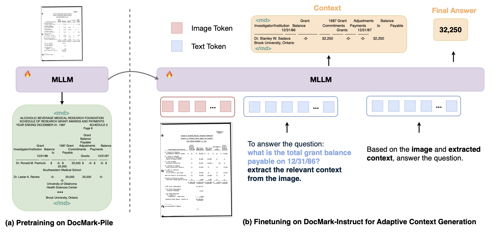
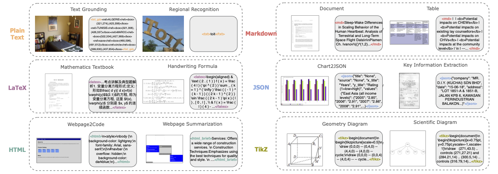
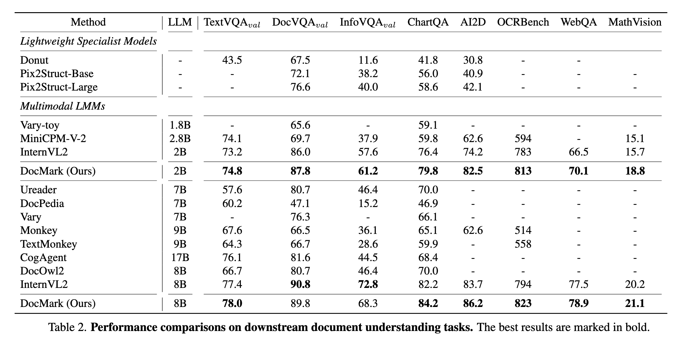

# DocMark: Adaptive Markup Language Generation for Contextually-Grounded Visual Document Understanding


Official repository for the CVPR 2025 paper "Adaptive Markup Language Generation for Contextually-Grounded Visual Document Understanding".


## About DocMark

Visual Document Understanding has become essential with the increase of text-rich visual content. This field poses significant challenges due to the need for effective integration of visual perception and textual comprehension, particularly across diverse document types with complex layouts.

We propose **DocMark**, an innovative pipeline that utilizes adaptive generation of markup languages, such as Markdown, JSON, HTML, and TiKZ, to build highly structured document representations and deliver contextually-grounded responses. Our approach:

1. **Converts documents to structured markup languages** that preserve rich semantic and layout information
2. **Generates contextually relevant markup code** as **intermediate reasoning** steps
3. **Adaptively selects the most appropriate markup language** for different document types

<div align="center">
  
</div>

## Key Contributions

1. A novel pipeline that adaptively uses various markup languages to bridge the gap between visual inputs and linguistic understanding, significantly enhancing document comprehension capabilities.

2. Two fine-grained structured datasets:
   - **DocMark-Pile**: 3.8M pretraining data pairs for document parsing
   - **DocMark-Instruct**: 624k fine-tuning annotations for grounded instruction following

3. State-of-the-art performance across various document understanding benchmarks, significantly outperforming existing MLLMs.


## Model Zoo

| Model | LLM Size | TextVQA | DocVQA | InfoVQA | ChartQA | AI2D | OCRBench | WebQA | MathVision |
|-------|----------|----------------|--------|---------|---------|------|----------|-------|------------|
| DocMark-2B| 2B | 74.8 | 87.8 | 61.2 | 79.8 | 82.5 | 813 | 70.1 | 18.8 |
| DocMark-8B | 8B | 78.0 | 89.8 | 68.3 | 84.2 | 86.2 | 823 | 78.9 | 21.1 |

## Datasets

<div align="center">
  
</div>

### DocMark-Pile (3.8M samples)

A comprehensive pretraining dataset for document parsing with various markup languages:

- **Plain Text**: Natural photos and regional text images
- **Markdown**: Dense text documents and tables
- **LaTeX**: Mathematics textbooks and handwritten formulas
- **HTML**: Webpages and webpage summarization
- **JSON**: Key information extraction from charts, receipts, and forms
- **TikZ**: Scientific and geometry diagrams


### DocMark-Instruct (624k samples)

Fine-tuning dataset featuring chain-of-thought-like reasoning annotations for contextually-grounded instruction following.


## Usage

### Training

```bash
# Pretraining on DocMark-Pile
bash exps/docmark_pretrain_2b.sh

# Fine-tuning on DocMark-Instruct
bash exps/docmark_finetune_2b.sh
```

### Inference

```python
#to be updated
```

## Results

DocMark significantly outperforms existing state-of-the-art MLLMs on document understanding tasks, particularly excelling in handling complex document formats and reasoning tasks.

<div align="center">
  
</div>

## Acknowledgements

We would like to thank the following repos for their great work:

- [InternVL](https://github.com/OpenGVLab/InternVL) for the base architecture
- [SWIFT](https://github.com/modelscope/ms-swift) for the training framework
- [VLMEvalKit](https://github.com/open-compass/VLMEvalKit) for the benchmark evaluation


## Citation

If you find DocMark useful for your research and applications, please kindly cite using this BibTeX:

```bibtex
@inproceedings{xiao2025docmark,
  title={Adaptive Markup Language Generation for Contextually-Grounded Visual Document Understanding},
  author={Xiao, Han and Xie, Yina and Tan, Guanxin and Chen, Yinghao and Hu, Rui and Wang, Ke and Zhou, Aojun and Li, Hao and Shao, Hao and Lu, Xudong and Gao, Peng and Wen, Yafei and Chen, Xiaoxin and Ren, Shuai and Li, Hongsheng},
  booktitle={Proceedings of the IEEE/CVF Conference on Computer Vision and Pattern Recognition (CVPR)},
  year={2025}
}
```


## Contact

For any questions or inquiries, please contact us at [1155229123@link.cuhk.edu.hk](1155229123@link.cuhk.edu.hk).
